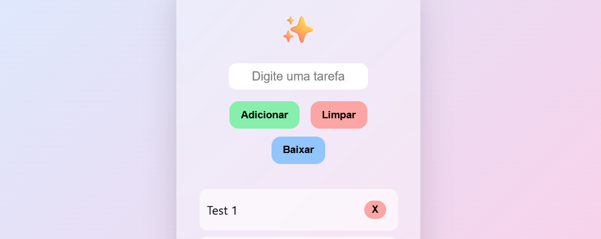

**🗒️Kanban**

Era pra ser apenas um app de lista e ainda só é isso. Mas a ideia é complementar ele com mais recursos para virar um mini-kanban. Atualmente, ele não está fazendo o download das listas. 

💊 Gosto de fazer essas soluções rápidas quando me deparo com alguma necessidade e não quero gastar dinheiro ou me registrar em alguma plataforma. <b>Sem internet, sem cadastro, só um software não corporativista.</b> E você pode me ajudar indo lá no https://livepix.gg/caindev e dar uma forcinha e/ou ideia para um novo projeto.
